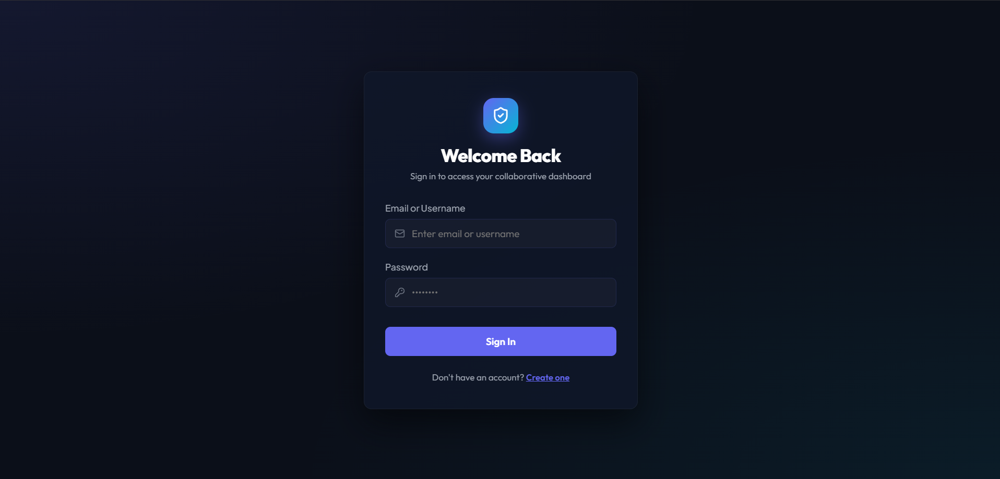
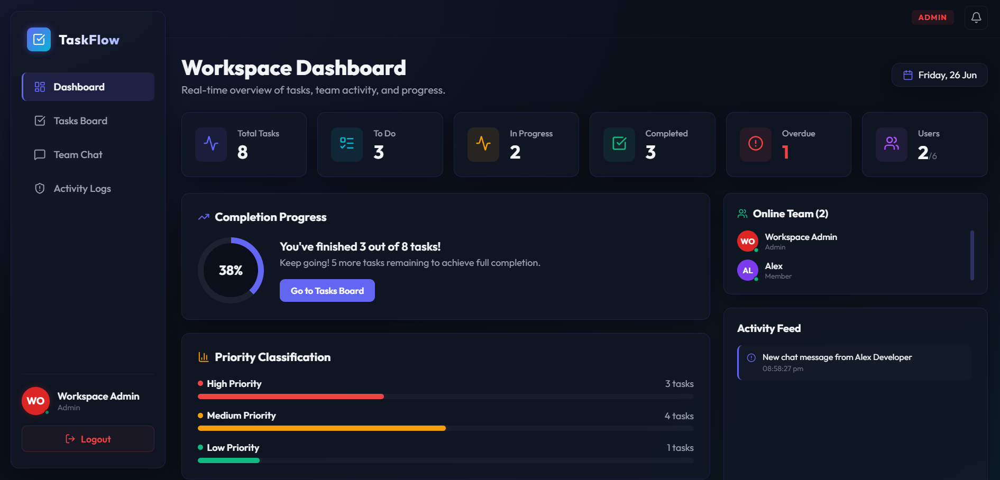
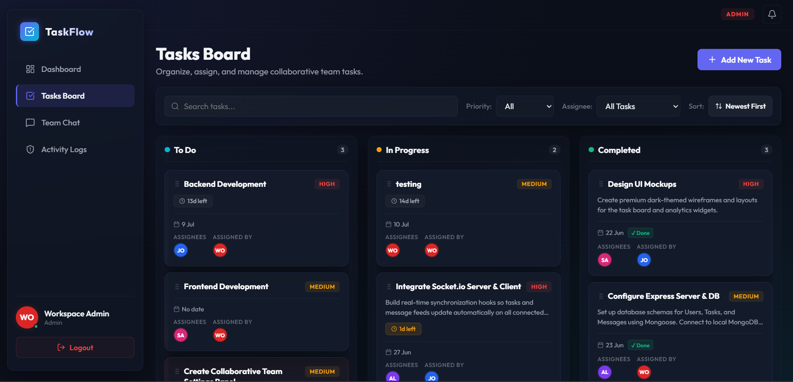
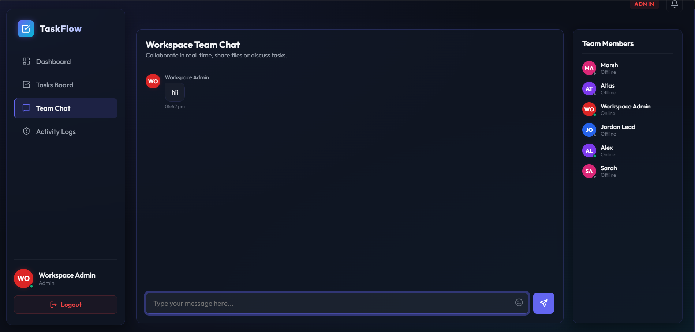
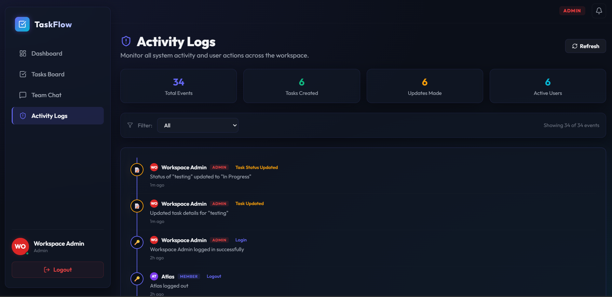
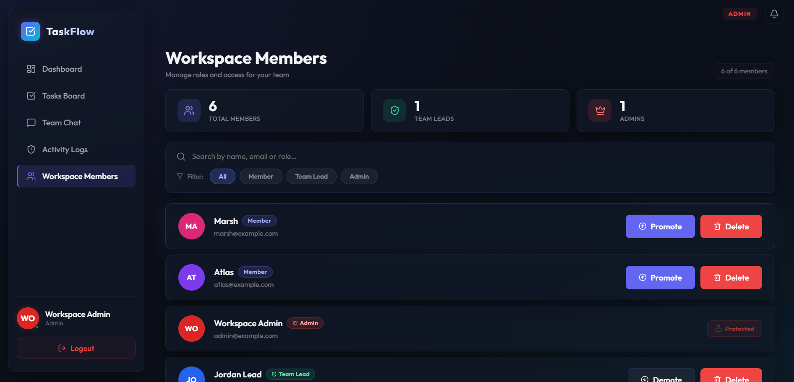

# 🚀 TaskFlow


# 🚀 Task Manager Web Application

A modern **real-time collaborative Task Management Web Application** built using the **MERN Stack**. The application enables teams to create, assign, organize, and monitor tasks efficiently through a clean dashboard, role-based access control, and real-time communication.

Designed with a modern glassmorphism interface, the application supports task collaboration, live notifications, online user tracking, activity logging, and drag-and-drop task management.

---

## 🚀 Live Demo

### 🌐 Frontend
https://real-time-task-manager-hazel.vercel.app

### ⚙️ Backend API
https://real-time-task-manager-l6tc.onrender.com

> **Note:** The backend is hosted on Render's free tier. It may take 30–60 seconds to respond after being idle.

---

## 📸 Screenshots

<table>
<tr>
<td></td>
<td></td>
</tr>

<tr>
<td align="center"><b>Login</b></td>
<td align="center"><b>Dashboard</b></td>
</tr>

<tr>
<td></td>
<td></td>
</tr>

<tr>
<td align="center"><b>Tasks Board</b></td>
<td align="center"><b>Team Chat</b></td>
</tr>

<tr>
<td></td>
<td></td>
</tr>

<tr>
<td align="center"><b>Activity Logs</b></td>
<td align="center"><b>Workspace Members</b></td>
</tr>


</table>
---

# ✨ Features

## 👤 Authentication

- Secure JWT Authentication
- Password Encryption using bcrypt
- User Login
- User Registration
- Protected Routes

---

## 👥 Role Based Access Control

### Admin

- View all tasks
- Create tasks
- Edit tasks
- Delete tasks
- Assign tasks
- View Activity Logs
- Dashboard Analytics

### Team Lead

- View all tasks
- Create tasks
- Edit tasks
- Delete tasks
- Assign tasks
- View Activity Logs

### Member

- View only assigned/owned tasks
- Update task status
- Participate in team chat

---

## ✅ Task Management

- Create Tasks
- Update Tasks
- Delete Tasks
- Assign Tasks
- Due Dates
- Priority Levels
- Task Status Tracking
- Kanban Board Layout
- Drag & Drop Task Status Updates
- Search Tasks
- Filter by Priority
- Filter by Assignee (Admin & Team Lead)
- Sort Tasks

---

## 📊 Dashboard

- Total Tasks
- Completed Tasks
- In Progress Tasks
- Todo Tasks
- Overdue Tasks
- Completion Percentage
- Priority Distribution
- Online Team Members
- Recent Activity Feed
- Admin Activity Logs

---

## 🔔 Real-Time Features

Powered by **Socket.io**

- Live Notifications
- Task Assignment Notifications
- Task Completion Notifications
- Task Status Updates
- Online User Status
- Live Team Chat
- Typing Indicator
- Automatic Dashboard Updates

---

## 📈 Activity Tracking

- Task Created
- Task Updated
- Task Deleted
- Task Assigned
- Task Status Updated

---

## 🎨 User Interface

- Modern Glassmorphism Design
- Responsive Layout
- Beautiful Dashboard
- Interactive Kanban Board
- Smooth Animations
- Dark Theme
- Responsive Cards

---

# 🛠️ Tech Stack

## Frontend

- React.js
- Vite
- CSS3
- Context API
- Socket.io Client
- Lucide React

## Backend

- Node.js
- Express.js
- MongoDB
- Mongoose
- Socket.io
- JWT Authentication
- bcrypt.js

---

# 📂 Project Structure

```
task-manager-web-application
│
├── frontend
│   ├── src
│   ├── public
│   └── package.json
│
├── backend
│   ├── models
│   ├── routes
│   ├── middleware
│   ├── socket
│   ├── server.js
│   └── package.json
│
├── screenshots
│
├── README.md
└── .gitignore
```

---

# ⚙️ Installation

## Clone Repository

```bash
git clone https://github.com/VrutikSotha/task-manager-web-application.git

cd task-manager-web-application
```

---

## Backend Setup

```bash
cd backend

npm install
```

Create `.env`

```env
PORT=5000

MONGO_URI=your_mongodb_connection_string

JWT_SECRET=your_secret_key
```

Run Backend

```bash
npm run dev
```

---

## Frontend Setup

```bash
cd frontend

npm install
```

Run Frontend

```bash
npm run dev
```

---

# 📌 Environment Variables

Backend `.env`

```env
PORT=

MONGO_URI=

JWT_SECRET=
```

---

# 📖 Usage

1. Register or Login.
2. Admin/Team Lead can create and assign tasks.
3. Members can view and update their assigned tasks.
4. Drag tasks between Kanban columns to update their status.
5. Receive live notifications for task assignments and updates.
6. Collaborate through the real-time team chat.
7. Monitor overall progress from the dashboard.

---

# 🔐 Security Features

- JWT Authentication
- Password Hashing using bcrypt
- Protected API Routes
- Role-Based Authorization
- Secure Task Visibility
- Server-side Permission Checks

---

# 🚀 Future Improvements

- Task Comments
- File Attachments
- Email Notifications
- Calendar View
- User Profile Management
- Workspace Invitations
- Export Reports
- Three-dot Action Menu on Task Cards

---

# 👨‍💻 Author

**Vrutik Sotha**

Final Year B.E. Computer Science Engineering Student

---

# ⭐ If you like this project

Please consider giving this repository a ⭐ on GitHub.